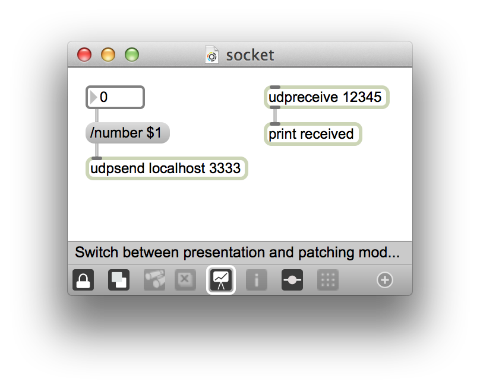

# Send A Message

### Installation

__Install [Homebrew](http://brew.sh/)__  
__Install [Node.js](http://nodejs.org)__  

```bash
brew install node
```

__Install [CoffeeScript](http://coffeescript.org/)__

```bash
npm install -g coffee-script
```

__Clone this directory and `cd` into it__  

```bash
git clone git@github.com:macklinu/send-a-message.git && send-a-message
```

__Install the dependencies__  

```bash
npm install
```

### Usage
__Run the server__

```bash
coffee server.coffee
```

__Open a browser tab(s) to http://localhost:3000__

You may choose the port if you would like, which is defined in `server.coffee`

__Open the `socket.maxpatch` Max patch__



Adjust the `[number]` box and see the number update in your browser tab(s).
